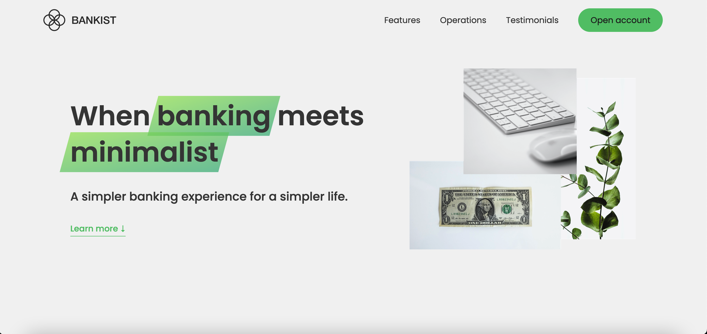

# Fake Bank Project

This is a fake bank webpage coded in HTML, CSS and Javascript here is a screenshot of the page:

 

Here is the live link: https://bankistbank.netlify.app/

Things I learned and practiced in this project:

- Used the Intersection Observer API and learned how to use it to make the navbar sticky after it reaches a certain point down the page.

- Learned how to use smooth scrolling to give the users a better experience on the website.

- Learned about lazy loading images to reduce load time of websites to benefit users.

- Learned how to reveal sections/elements only when you scroll down to them with a cool animation.

- Learned how to create a testimonial slider which was new to me and quite complex but really enjoyed creating it.